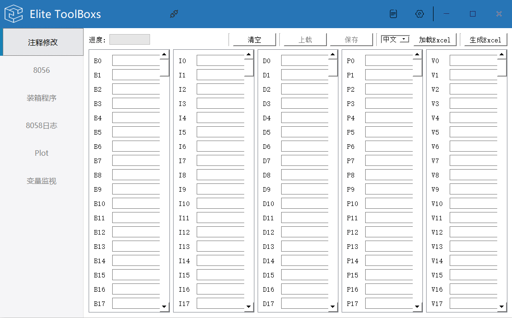
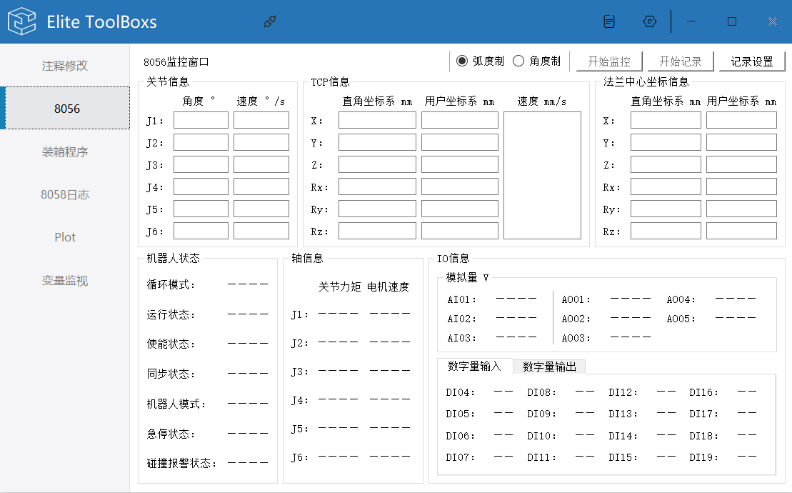
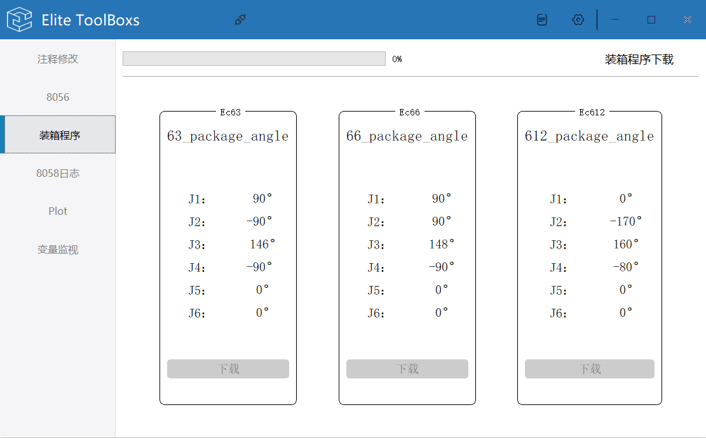
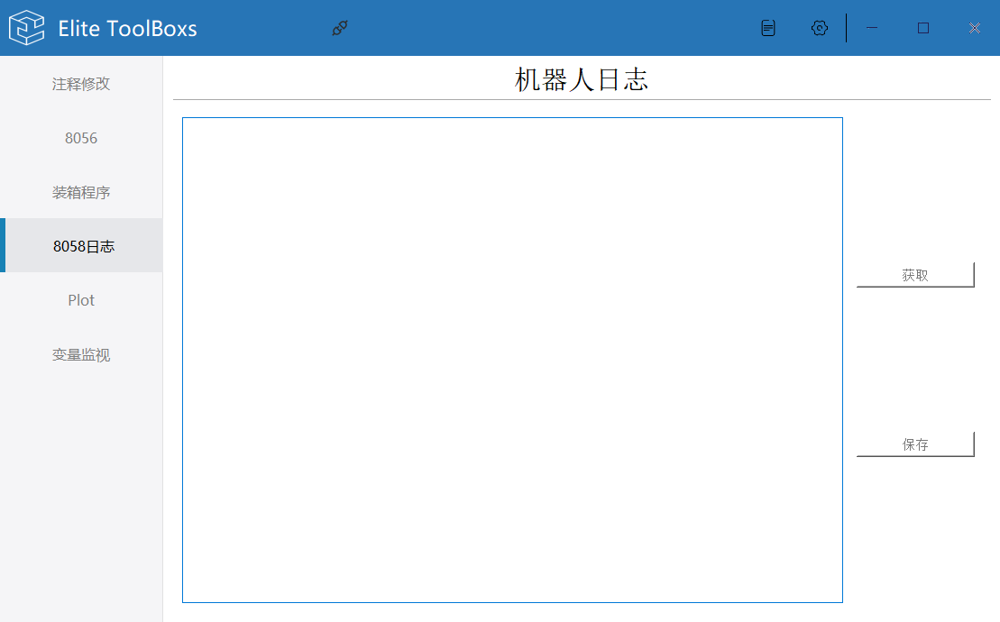
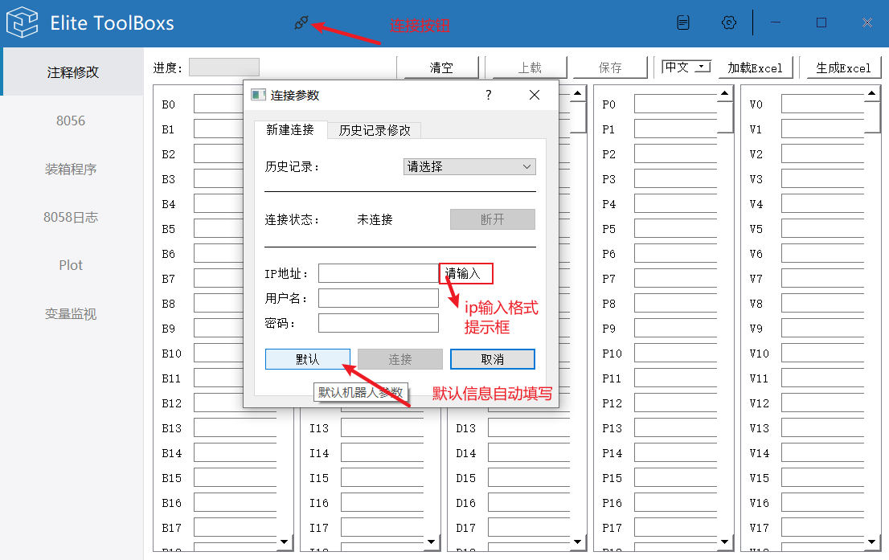
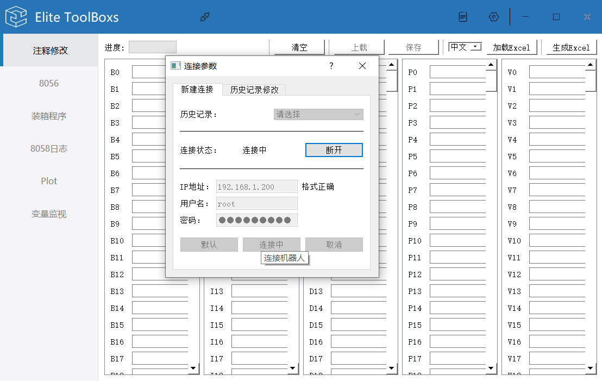
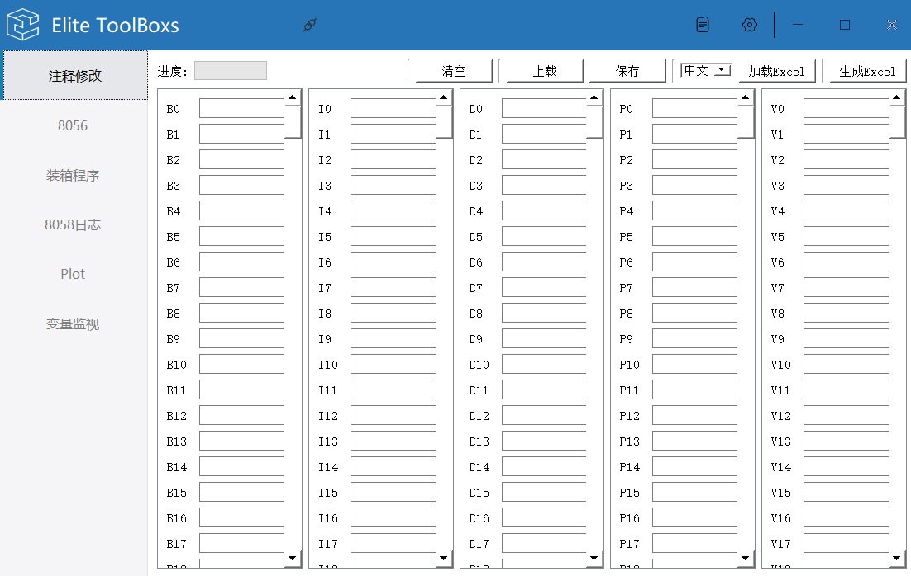
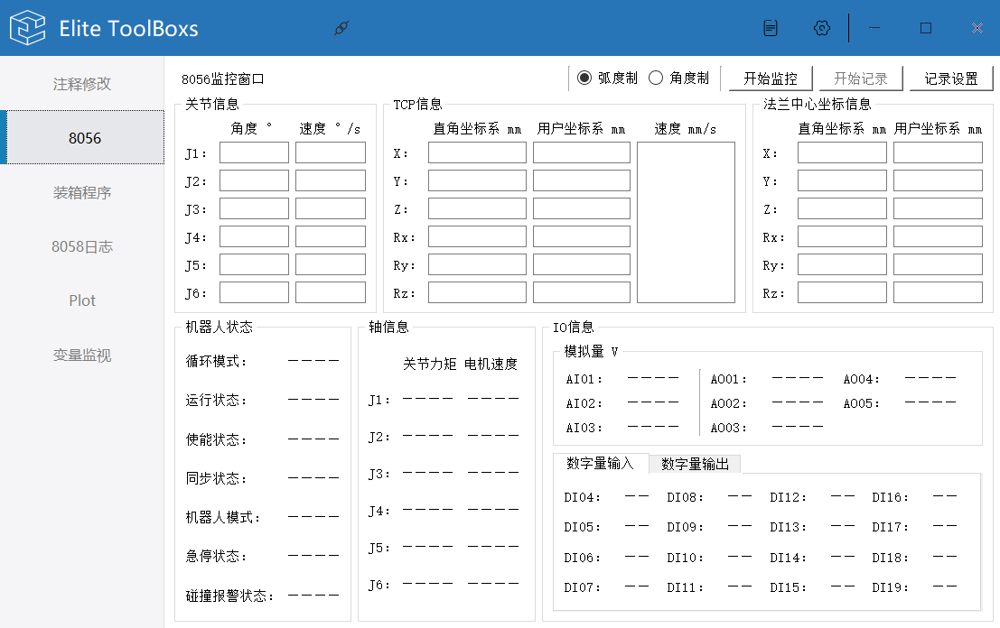
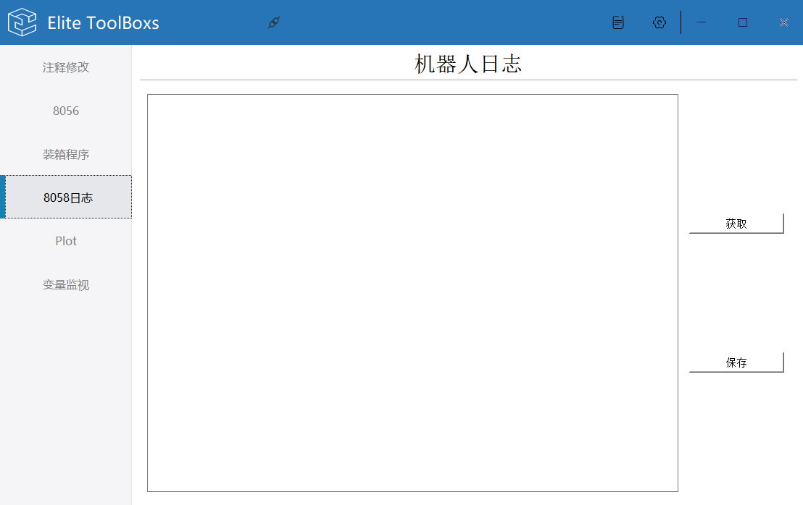

### EliteToolBox简介：

​		EliteToolBox内集成了部分简单易用的小功能，目的是解决日常使用过程中一些简单重复工作的需求，意在将重复的工作简单化，使工程师可以更高效的利用机器人做一些更有创造性的工作。

​		**让明天比今天更简单一点**

​		**Always Easier Than Before**

​		目前已经集成如**注释修改**、**监控端口信息显示**、**装箱程序一键下载**、**机器人日志提取**等小功能，后续将继续挖掘机器人在使用过程中的一些实用性需求。

​		如有需要的功能开发，可以联系Elite技术人员，需明确使用场景、需求以及想要达到的效果，相关技术人员会评估该功能的实用性、通用性以及开发难度！

​		

#### 支持信息：

​		该软件目前仅支持Windows平台，即点即用。仅支持中文！！！

​		已知在双屏切换时，会出现部分界面显示异常情况，此时双击标题栏或单击最大化按钮，并再次双击标题栏或单击最大化按钮，页面即可恢复正常。

​		已知在高于1080 * 1920屏幕分辨率的电脑有可能会出现界面异常，请切换至1080 * 1920分辨率后使用。

#### 功能列表：

- 注释修改

> 上载机器人内部B、I、D、P、V变量注释信息，也可以修改后下载至机器人中
>
> 支持从Excel表格导入，或导出至Excel表格（表格格式为特殊表格，可以先利用生成Excel按钮生成空白信息表格，进行填写）

- 8056监控信息显示

> 该功能适用于2.13.1及以上版本
>
> 需要在**"系统>系统配置>机器人配置"**中勾选**"通用"**中的**“远程”**功能
>
> 该功能展示Elite机器人8056端口的信息内容，将其可视化，更利于观察机器人状态及数据之间的变化
>
> 数据保存功能已经在做啦，进度0%

- 装箱程序下载

> EC系列机器人官方打包程序一键下载
>
> EC612目前为最新的打包程序，即对应纸质打包箱

- 8058日志提取

> 机器人log日志提取、保存

------

#### 功能介绍与使用

*所有按钮都有悬浮提示功能*

##### 硬件连接机器人

​		电脑的网线连接至机器人或机器人已经连接到的局域网中，确保电脑的ip与机器人ip在同一网段中，利用cmd命令可以ping通机器人

##### 软件连接机器人

- 一般情况下，点击**连接按钮**后，连接状态显示为连接中则表示电脑和机器人的网络不通，需要检查对应对应的硬件连接和软件设置
- 各项功能的按钮会在连接成功后呈现可以点击状态，灰色即为不可点击
- 可以通过点击默认按钮，自动填入信息后，修改ip为实际机器人ip信息在进行连接
- 对于不同的ip连接成功后，下次连接会在历史记录下拉框显示，方便再次进行连接
- 连接图标会实时反应当前网络的连接情况

##### 注释修改

- 注释修改，先点击**上载**按钮，会将机器人目前的注释信息解析至界面中，**防止误修改注释信息**
- 在界面上修改对应的注释信息后，点击**保存**，将界面上的信息下载至机器人，示教器上重新打开对应的变量界面，即可显示对应的注释
- 加载Excel将根据**对应的语言选项**加载**对应格式的Excel文件信息**至软件界面，再点击**保存**即可下载至机器人。标准Excel注释文件请通过生成Excel按钮生成
- 生成Excel将**根据界面信息**及**语言选项**生成对应的Excel文件，**空白Excel注释文件**请先点击**清空**按钮，再点击**生成**按钮进行生成

##### 8056

- 该功能适用于2.13.1及以上版本
- 需要在**"系统>系统配置>机器人配置"**中勾选**"通用"**中的**“远程”**功能
- 由于**不同版本**的8056信息反馈的数据不同，界面上某些数据不予更新
- 点击开始监控后，界面刚开始更新后会有短时间会停止更新，此时在自动解析反馈的数据长度，稍后对应的数据便会正常更新
- 对应的坐标系数据可以通过鼠标选中进行复制
- 开始记录和记录设置功能暂时不可用

##### 装箱程序

- 装箱程序界面如上图所示，点击对应的下载按钮后会下载对应的打包程序至机器人中
- 对应类型机器人的打包角度也在界面上显示，方便操作人员查看界面数值手摇至打包姿态

##### 8058日志

- 获取按钮获取截止目前为止，机器人内部的日志信息
- 保存按钮将其保存至本地，文件格式为txt

#### 关于新的需求

​		如有需要的功能开发，可以联系Elite技术人员，需明确使用场景、需求以及想要达到的效果，相关技术人员会评估该功能的实用性、通用性以及开发难度！！！

​		该软件不定期更新，以后的以后会增加一键更新功能。如需获取最新版本软件，请联系Elite技术人员

​		该软件版本发布的文件夹名称进行区分。

#### 问题反馈及Bug提交

​		如在使用过程中发现问题，请将**使用时场景**以及**操作逻辑**叙述清晰，并将**log文件夹对应日期的log日志**提交至Elite技术人员，这将有助于复现和分析问题，并提高解决问题的效率。